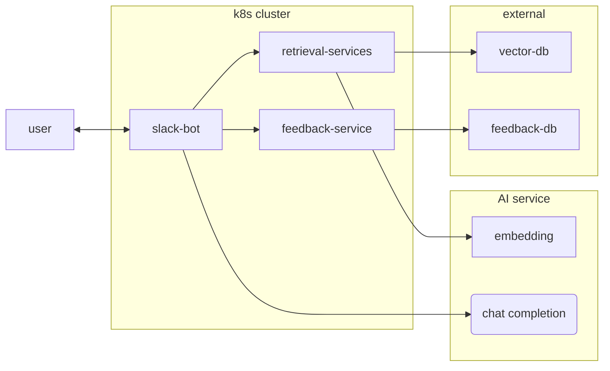

# 프로젝트 루모스

## 서비스 구성도 초안

```mermaid
flowchart LR

subgraph k8s cluster
    slack-bot
    retrieval-services
    feedback-service
end

subgraph AI service
    embedding
    chat(chat completion)
end

subgraph external
    vector-db
    feedback-db
end


user <--> slack-bot
slack-bot --> retrieval-services

retrieval-services --> embedding
retrieval-services --> vector-db
slack-bot --> chat
slack-bot --> feedback-service
feedback-service --> feedback-db
```
